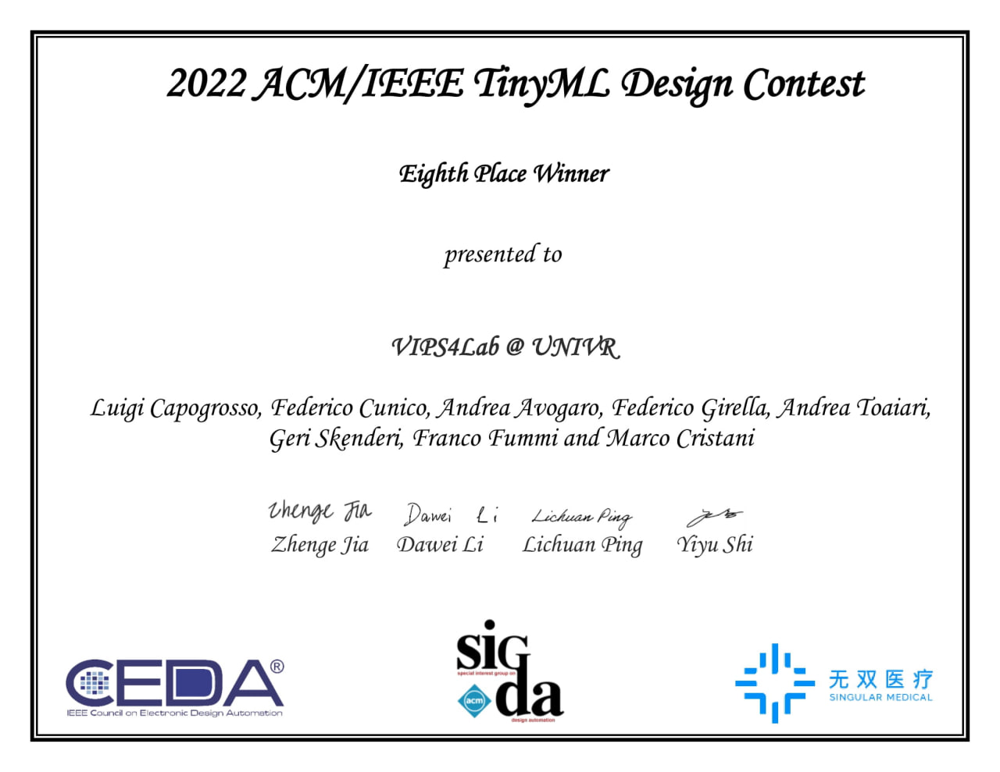

# ACM/IEEE TinyML Design Contest at ICCAD 2022 - VIPS4Lab @ UNIVR #

The official implementation of the VIPS4Lab @ UNIVR for the _2022 ACM/IEEE TinyML Design Contest at ICCAD_.

<p align="center">
    
</p>

## Results ##

| Model     | F-1   | F-B   | SEN   | SPE   | BAC   | ACC   | PPV   | NPV   | Mn    | Ln   | Score  |
|-----------|-------|-------|-------|-------|-------|-------|-------|-------|-------|------|--------|
| TinyModel | 0.955 | 0.979 | 0.995 | 0.934 | 0.964 | 0.960 | 0.917 | 0.996 | 27.11 | 4.54 | 135.75 |

## Code Organization ##

The repository is organized as follows:
* In the root folder, the main programs can be found:
    * `train.py` used to train our network.
    * `evaluate.py` used to evaluate our network and calculate the metrics.
    * `convert.py` used to convert a given `<model_name>.pkl` to a `network.onnx` file.

* The `data` folder contains the `.csv` files listing the train and test splits of the dataset given by the challenge organizers.

* The `datasets` folder includes `iegm.py`, the python definition of the dataset used in this challenge.

* The `models` folder includes `tinyml_univr.py`, the python definition of the `PyTorch` model created for this challenge, named `TinyModel`.

* The `utils` folder contains different definitions of functions used throughout our training/testing procedures, including metrics calculations, logging and data processing.

* `X-CUBE-AI-code` contains the `C` code to compile the network and run evaluation on board, as specified by the challenge organizers.

* The `checkpoints` folder will be used to store the model checkpoints (`<model_name>.pkl`) obtained during training, the performance reports for the best model obtained during training or evaluation (`<model_name>_<mode>_results.txt`) and the `network.onnx` for the challenge submission.

## Data Structure ##

The actual data for the challenge will not be included in this repository.
Whenever we refer to the `data_dir` in this repository, we expect a path pointing to a folder, containing all the data.

For example, if `data_dir` was `<path_to_folder>/tinyml_data/`, and assuming the same data given for the challenge, the directory tree should look like:
```
<path_to_folder>
|__tinyml_data
    |   S01-AFb-1.txt
    |   S01-AFb-2.txt
    |   ...
    |   S95-VT-342.txt
```

## Installation ##

* Clone this repo, we'll refer to the directory that you cloned as ${TINYML_CONTEST}.
* Install dependencies. We use python 3.9, PyTorch >= 1.12.1 and CUDA 11.3.
```
conda create -n tinyml python=3.9
conda activate tinyml
pip3 install torch torchvision torchaudio --extra-index-url https://download.pytorch.org/whl/cu113
cd ${TINYML_CONTEST}
pip install -r requirements.txt
```

## Training ##

* Launch `train.py` with the desired parameters.
* Be sure to set `--data_dir` to the directory containing the data (not the indexes).
* By default the scripts trains over the concatenation of both the Train and Test partition of our data. Use `--not_concatenate_ts` if you wish to train only over the Train partition.
* **IMPORTANT:** starting a new training with `--checkpoints_dir` set to folder `./checkpoints` (default) will OVERRIDE the files currently saved in that folder!
```
python train.py --data_dir `<path_to_folder/>' --checkpoints_dir <path/to/save/destination/folder>
```

## Testing ##

* Launch `evaluate.py` with the desired parameters.
* `--data_dir` should point to the directory containing the data (not the indexes).
* Be sure to set `--pretrained_model` to the path pointing to the `<model_name>.pkl` checkpoint you wish to use, then:
```
python evaluate.py --pretrained_model './checkpoints/tinymodel.pkl' --data_dir `<path_to_folder/>'
```

## Conversion ##

* Launch `convert.py` with the desired parameters.
* Be sure to set `--pretrained_model` to the path pointing to the `<model_name>.pkl` to the path pointing to the `<model_name>.pkl` checkpoint you wish to convert to ONNX format.
* The output model will always be called `network.onnx` and be located in the same folder of the `<model_name>.pkl` file used for the conversion.
* **IMPORTANT:** starting a new conversion **will replace** the `network.onnx` currently present in the `--pretrained_model` directory!
```
python convert.py --pretrained_model './checkpoints/tinymodel.pkl'
```

## Reproduce with Docker ##

As an alternative, you can use Docker to perform the training (although it may be 10-15% slower). In order to do this you will need to:

1. Install Docker and [nvidia-docker](https://docs.nvidia.com/datacenter/cloud-native/container-toolkit/install-guide.html). It is recommended to apply the post installation steps for docker on linux.
2. Make `./docker_build_run.sh` and `./utils/pipeline.sh` executable with.
```
    chmod +x ./docker_build_run.sh
    chmod +x ./utils/pipeline.sh
```

3. If correctly installed, you should be able to execute `./docker_build_run.sh`, which builds and runs the pipeline (train + evaluation + onnx creation).

4. After the run, the `network.onnx` file is created in the `checkpoints/` folder, along with the results.
